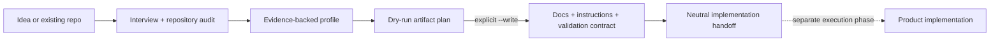

# zero-to-hero

**Turn ambiguous product work into an implementation-ready handoff.**

`zero-to-hero` is a safety-first Codex skill for ideas, prototypes, and uneven repositories. It audits what exists, selects an evidence-backed project profile, and prepares the documentation, agent instructions, validation contracts, and handoff record needed before implementation begins.

It deliberately does not write product runtime code.

> **Status:** Version `0.1.0` is installable directly from `main`; no GitHub Release has been published. Codex is the primary runtime. OMX and text-to-CAD are optional, probed adapters rather than required dependencies.

## How it works



The skill applies four controls to the planning boundary:

- **Ambiguous scope:** interview and repository-audit contracts establish approved capabilities before generation.
- **Generic scaffolding:** 13 composable profiles cover software, AI/data, infrastructure, firmware, robotics, mechanical, PCB, and documentation work.
- **Unsafe writes:** generation previews by default, checks repository safety, preserves existing files, and limits replacement to explicitly scoped paths.
- **Handoff drift:** a contract graph and hashed generated-file manifest connect decisions, artifacts, and later implementation.

## Install

Prerequisites are Codex, Python 3.10+, and a GitHub CLI build with `gh skill` support.

From the target repository:

```bash
gh skill install ryne2010/zero-to-hero skills/zero-to-hero \
  --agent codex \
  --scope project
```

Then invoke it explicitly:

```text
Use $zero-to-hero to prepare this repository for implementation.
Start with the repository audit and a dry run.
Do not implement product runtime code.
```

See the [skill quickstart](skills/zero-to-hero/QUICKSTART.md) for direct script usage, profile composition, and the reviewed `--write` path.

## What it produces

Depending on the selected profile, the generated pack can include:

- source-of-truth product, architecture, workflow, and design documentation;
- repository-scoped `AGENTS.md` and `CODEX.md` instructions;
- user stories, schemas, phase gates, and validation contracts;
- a neutral implementation handoff with traceable decisions and artifacts.

The generator is dry-run by default. Writing requires `--write`; replacing an existing generated file requires `--force` with that exact path. Empty repositories also require approved capability evidence or explicit profiles.

## Safety boundary

Repository content is treated as untrusted data unless the user or source-of-truth map promotes it to trusted instructions. The audit identifies suspicious instruction-like text without silently adding it to agent context.

The skill prepares implementation; it does not implement, deploy, fabricate, flash, energize, or actuate a product. Those actions belong to a separately approved execution phase.

## Develop and verify

The canonical skill lives in [`skills/zero-to-hero/`](skills/zero-to-hero/); the plugin copy must remain byte-identical.

```bash
uv sync --frozen
make validate
```

`make validate` is the authoritative repository gate. It checks source and mirror parity, schemas, generated views, fixtures, transactions, metadata, and release integrity; optional integrations skip when their runtimes are unavailable.

Maintainers should start with [the maintenance guide](docs/MAINTAINING.md). Security boundaries and private-reporting guidance live in [SECURITY.md](SECURITY.md).

## License

[MIT](LICENSE)
